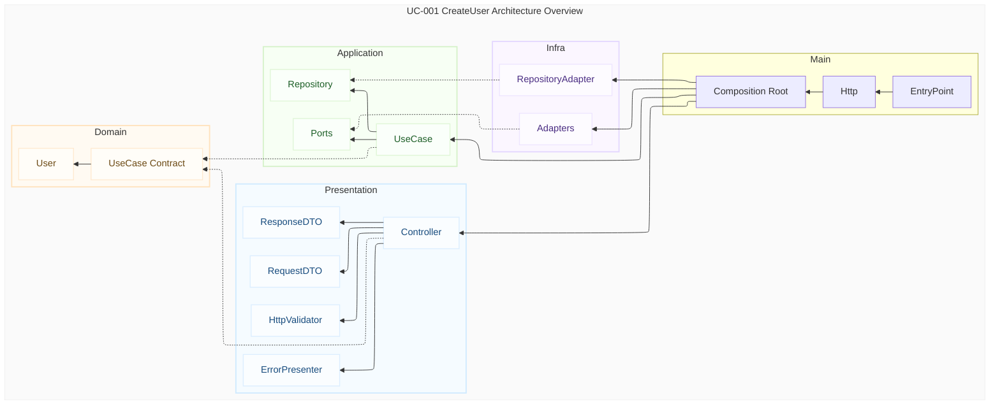

# Feature: UC-001 CreateUser Architecture

```mermaid
---
config:
  layout: elk
---

flowchart RL

  subgraph Architecture[UC-001 CreateUser Architecture Overview]
    %% Main
    subgraph Main
      Composition[Composition Root]
      EntryPoint
      Http
    end
          %% Main Relations
          EntryPoint --> Http
          Http --> Composition
          Composition --> Controller
          Composition --> UseCase
          Composition --> Adapters
          Composition --> RepositoryAdapter

    %% Presentation
    subgraph Presentation
      Controller 
      ErrorPresenter
      HttpValidator
      RequestDTO   
      ResponseDTO 
    end
          %% Presentation Relations
          Controller -.-> CreateUser
          Controller --> RequestDTO
          Controller --> ResponseDTO
          Controller --> HttpValidator
          Controller --> ErrorPresenter    

    %% Infra
    subgraph Infra
      Adapters
      RepositoryAdapter
    end


    %% Application
    subgraph Application
      UseCase
      Repository
      Ports
    end
          %% Application Relations
          UseCase --> Ports
          UseCase --> Repository
          UseCase -..-> CreateUser
          Adapters -.-> Ports
          RepositoryAdapter -.-> Repository
          
    %% Domain
    subgraph Domain
      CreateUser[UseCase Contract] --> User
    end

  end

  %% Panels Styling
  style Presentation fill:#F5FBFF,stroke:#CFEAFF,stroke-width:2px
  style Application  fill:#F7FFF4,stroke:#D5F1C9,stroke-width:2px
  style Domain       fill:#FFFAF2,stroke:#FFE2BC,stroke-width:2px
  style Infra        fill:#FBF6FF,stroke:#E4D7FF,stroke-width:2px
  style Architecture fill:#fafafa,stroke:#e3e3e3,stroke-width:0.5px

  %% Classes
  classDef presentation fill:#FAFDFF,stroke:#DCEEFF,stroke-width:1.5px,color:#184C7E;
  classDef application  fill:#FAFFFA,stroke:#E0F6D7,stroke-width:1.5px,color:#1E5F28;
  classDef domain       fill:#FFFDF8,stroke:#FFEAD1,stroke-width:1.5px,color:#6C4A15;
  classDef infra        fill:#FDFBFF,stroke:#EEE6FF,stroke-width:1.5px,color:#4B2E83;

  %% Apply Classes
  class Controller,RequestDTO,ResponseDTO,HttpValidator,ErrorPresenter presentation;
  class Adapters,RepositoryAdapter infra;
  class UseCase,Ports,Repository application;
  class CreateUser,User domain;


```