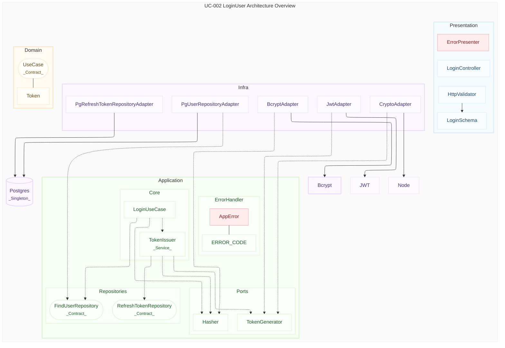

# Feature: UC-002 Login Architecture
  

Expand Mermaid code

> If the diagram don't looks like the image above, github probably don't support elk layout in mermaid preview yet.

```mermaid
---
config:
  layout: elk
  elk:
    mergeEdges: false
    nodePlacementStrategy: NETWORK_SIMPLEX
---

flowchart TB

  subgraph Architecture[UC-002 LoginUser Architecture Overview]

    %% Infra
    subgraph Infra
      Adapters[BcryptAdapter]
      PgUserRepositoryAdapter
      PgRefreshTokenRepositoryAdapter
      JwtAdapter
      CryptoAdapter
    end
          %% Infra Relations
          Adapters --> Bcrypt
          JwtAdapter --> JWT
          CryptoAdapter ---> Node
          PgUserRepositoryAdapter --> DB[("Postgres<br><small>_Singleton_</small>")]
          PgRefreshTokenRepositoryAdapter --> DB[("Postgres<br><small>_Singleton_</small>")]

    %% Application
    subgraph Application
      subgraph Core
      UseCase[LoginUseCase]
      Service["TokenIssuer<br><small>_Service_</small>"]
      end
      subgraph Repositories
      Repository(["FindUserRepository<br><small>_Contract_</small>"])
      Repository2(["RefreshTokenRepository<br><small>_Contract_</small>"])
      end
      subgraph Ports
       Hasher
       TokenGenerator
      end
      subgraph ErrorHandler
      AppError
      ErrorCode[ERROR_CODE]
      end
    end
          %% Application Relations
          UseCase -.-> Hasher
          UseCase -.-> Repository
          UseCase -.-> Service
          Service -.-> TokenGenerator
          Service -.-> Hasher
          Service -.-> Repository2
          JwtAdapter -.-> TokenGenerator
          CryptoAdapter -.-> TokenGenerator
          Adapters -.-> Hasher
          PgUserRepositoryAdapter -.-> Repository
          AppError --- ErrorCode

    %% Domain
    subgraph Domain
      UseCaseContract(["UseCase<br><small>_Contract_</small>"]) --- Token
    end

    %% Presentation
    subgraph Presentation
    direction TB
      Controller[LoginController]
      ErrorPresenter[ErrorPresenter]
      HttpValidator[HttpValidator]
      Schema[LoginSchema]
    end
              %% Presentation Relations
              HttpValidator ---> Schema

  end

  %% Panels Styling
  style Presentation fill:#F5FBFF,stroke:#CFEAFF,stroke-width:2px
  style Application  fill:#F7FFF4,stroke:#D5F1C9,stroke-width:2px
  style Domain       fill:#FFFAF2,stroke:#FFE2BC,stroke-width:2px
  style Infra        fill:#FBF6FF,stroke:#E4D7FF,stroke-width:2px
  style Architecture fill:#fafafa,stroke:#e3e3e3,stroke-width:0.5px

  %% Classes
  classDef application  fill:#FAFFFA,stroke:#E0F6D7,stroke-width:1.5px,color:#1E5F28;
  classDef domain       fill:#FFFDF8,stroke:#FFEAD1,stroke-width:1.5px,color:#6C4A15;
  classDef infra        fill:#FDFBFF,stroke:#EEE6FF,stroke-width:1.5px,color:#4B2E83;
  classDef external     fill:#FBF6FF,stroke:#E4D7FF,stroke-width:2px,color:#4B2E83;
  classDef error        fill:#FFECEC,stroke:#F0AAAA,stroke-width:1px,color:#8C2020;
  classDef presentation fill:#FAFDFF,stroke:#DCEEFF,stroke-width:1.5px,color:#184C7E;

  %% Apply Classes
  class Controller,HttpValidator,ErrorPresenter,Schema presentation;
  class Adapters,RepositoryAdapter,PgUserRepositoryAdapter,PgRefreshTokenRepositoryAdapter,CryptoAdapter,JwtAdapter,Node,JWT infra;
  class UseCase,Repositories,Ports,Repository,Repository2,ErrorCode,ErrorHandler,Core,Service,Hasher,TokenGenerator application;
  class UseCaseContract,Token domain;
  class Bcrypt,DB external;
  class AppError,ErrorPresenter error;
```

